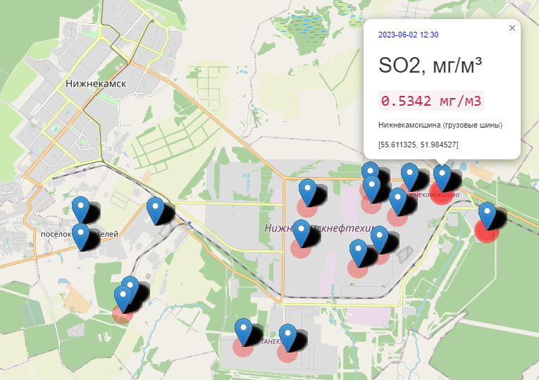

## Описание проекта  
#### Решаемая проблема

Территории с развитой промышленностью являются источниками повышенной экологической опасности
из-за интенсивной деятельности производственных предприятий.
К таким территориям относятся Нижнекамск и соседние районы,
где расположен один из крупнейших в России центров нефтехимической, нефтеперерабатывающей и энергогенерирующей промышленности.

Наблюдения за состоянием воздушного пространства проводятся на стационарных постах,
обеспечивающих регистрацию загрязнений в атмосферном воздухе
и являющихся составной частью государственной системы мониторинга атмосферы.
При этом оценка качества воздуха производится в удаленных от промышленных зон жилых районах. 
Однако в рамках существующей сети контроля окружающей среды на жилых территориях
промышленные объекты могут нарушать нормы допустимых выбросов,
так как сложно аргументированно доказать определяющий вклад конкретного промышленного объекта в общее загрязнение .

Поэтому при организации комплексной системы экологического мониторинга воздуха актуальным вопросом
является точное и объективное определение мест расположения источников загрязнения со стороны промышленной зоны.

#### Цель
Разработка системы для определения источников загрязнения воздуха
на основе ml-модели для прогнозирования пространственно-временного распределения концентраций загрязняющих веществ.

#### Результат
Подход к решению описан в [презентации](https://github.com/Svkhorol/Air_Pollution_Nizhnekamsk/blob/main/docs/approach.pdf).

Разработанный картографический сервис позволяет:
- визуализировать изменение и распределение содержания веществ в воздухе во времени и в пространстве
- рассчитывать содержание загрязнителей атмосферы любого типа
- определять местоположение источника загрязнения, находящегося в любом месте
- сохранять результаты вычислений в базу данных.

## Запуск приложения
[Архитектура приложения и инструкция по его запуску на локальном сервере](app/readme.md)

## Структура проекта
|      |     | 
|-------------|-------------| 
| [`app/`](https://github.com/Svkhorol/Air_Pollution_Nizhnekamsk/tree/main/app)  | веб-приложение для визуализации данных на карте  | 
| [`data/`](data)        | директория для хранения данных для тренировки моделей   | 
| [`docs/`](https://github.com/Svkhorol/Air_Pollution_Nizhnekamsk/tree/main/docs)   | документация и изображения, используемые в проекте  | 
| [`notebooks/`](https://github.com/Svkhorol/Air_Pollution_Nizhnekamsk/tree/main/notebooks)  | jupyter-ноутбуки с экспериментами и метриками    | 
| [`hyperparams.json`](https://github.com/Svkhorol/Air_Pollution_Nizhnekamsk/blob/main/hyperparams.json)       | файл с гиперпарамерами для обучения моделей    | 
| [`train.py`](https://github.com/Svkhorol/Air_Pollution_Nizhnekamsk/blob/main/train.py)   | скрипт для обучения моделей     | 
